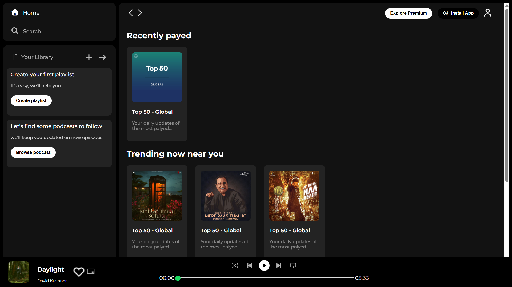
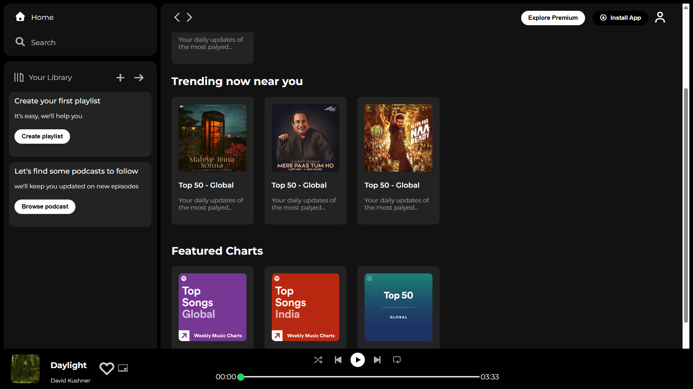
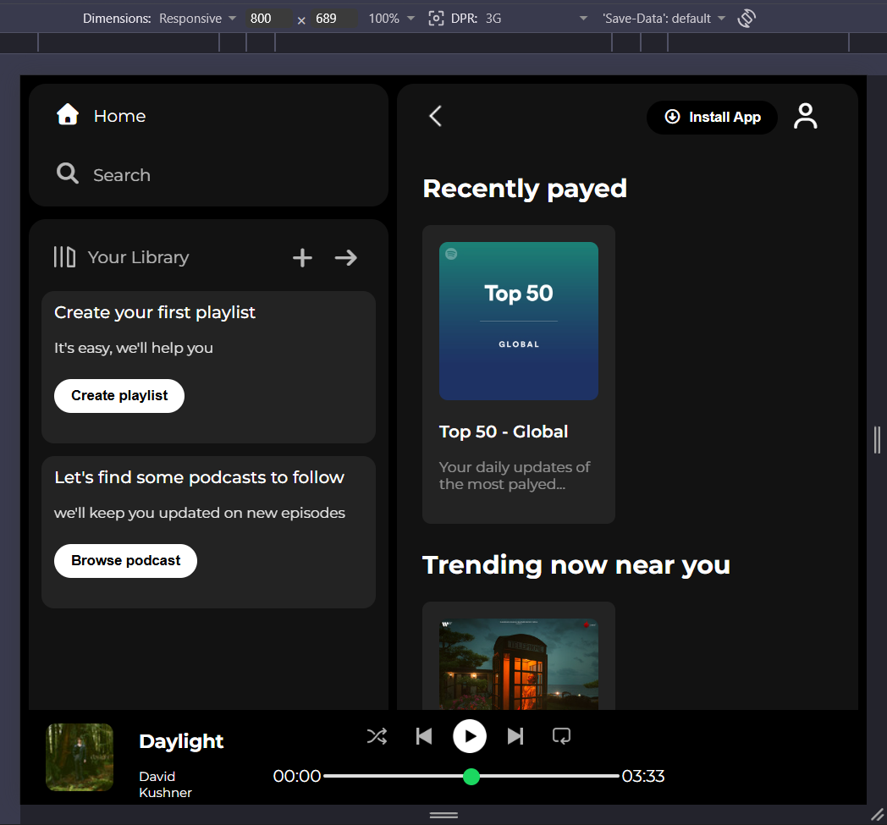
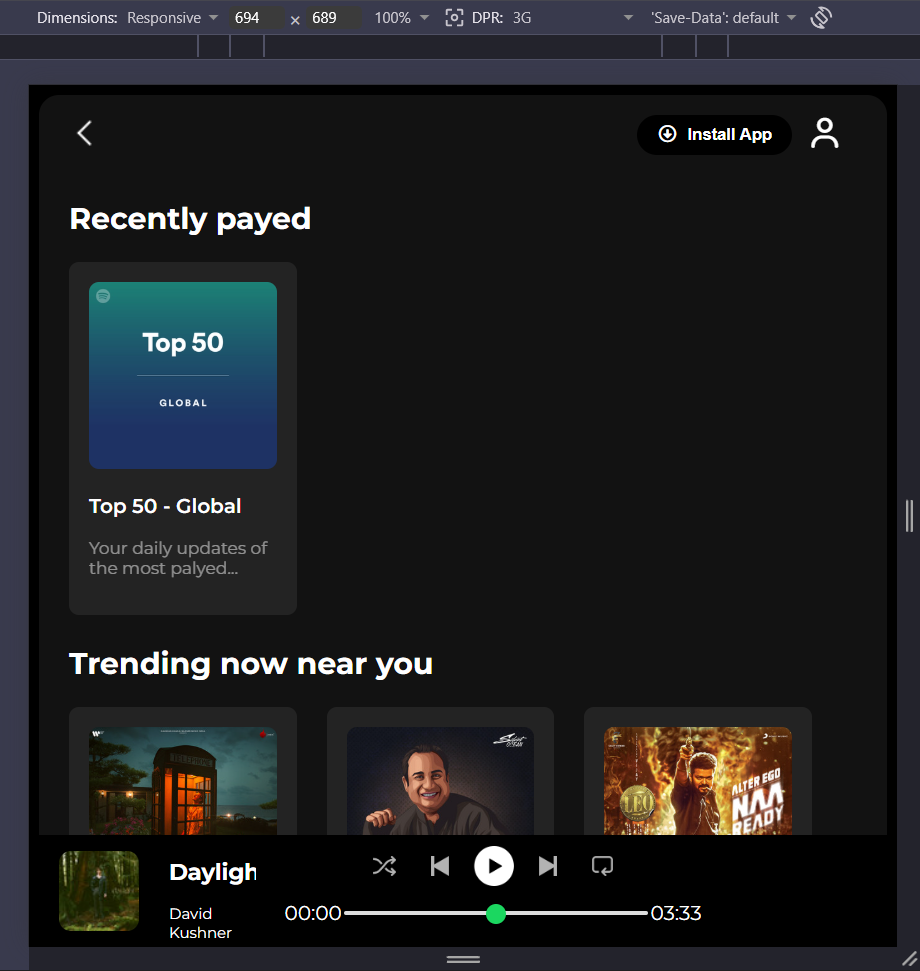

# SoundScape – Spotify UI Clone 🎵

A responsive **Spotify Web Player Clone** built using pure **HTML5** and **CSS3**.
This project recreates the modern Spotify interface with a clean layout, music cards, sidebar navigation, sticky navbar, and a music player UI.

---

## 🚀 Project Preview

> A beginner-friendly frontend project focused on mastering layouts, flexbox, responsiveness, UI design, and modern CSS styling.

---

# ✨ Features

* 🎧 Spotify-inspired modern UI
* 📱 Responsive design
* 📚 Sidebar navigation section
* 🎵 Music cards and playlist sections
* 📌 Sticky top navigation bar
* 🎚️ Music player layout at bottom
* 🎨 Smooth hover effects and clean styling
* 🌐 Font Awesome icons integration
* 🔤 Google Fonts (Montserrat)

---

# 🛠️ Tech Stack

| Technology   | Usage                    |
| ------------ | ------------------------ |
| HTML5        | Structure of the webpage |
| CSS3         | Styling and layout       |
| Flexbox      | Responsive alignment     |
| Font Awesome | Icons                    |
| Google Fonts | Typography               |

---

# 📂 Project Structure

```bash
spotify-ui-clone/
│
├── index.html
├── style.css
├── README.md
│
├── assets/
│
└── PREVIEW/
    ├── PREVIEW_1.png
    ├── PREVIEW_2.png
    ├── RESPONSIVE_PREVIEW_1.png
    └── RESPONSIVE_PREVIEW_2.png
```

---

# 📸 PROJECT PREVIEW (Screenshots)


```md
## Desktop View





---

## Responsive Mobile View




```

---

# 🎯 What I Learned

Through this project, I learned:

* Building responsive layouts using Flexbox
* Creating reusable UI sections
* Using icons and custom fonts
* Managing spacing, alignment, and positioning
* Designing modern web interfaces
* Structuring frontend projects properly

---

# 🔧 Installation & Setup

1. Clone the repository

```bash
git clone https://github.com/Coding-Slug-1/SoundScape-Spotify-UI-Clone-.git
```

2. Open the project folder

```bash
cd SoundScape-Spotify-UI-Clone-
```

3. Run the project

Simply open `index.html` in your browser.

---

# 🌟 Future Improvements

* Add JavaScript functionality
* Integrate real music playback
* Add animations and transitions
* Connect with Spotify API
* Add dark/light mode toggle
* Improve mobile responsiveness further

---

# 🤝 Contributing

Contributions, suggestions, and feedback are welcome.

If you'd like to improve this project, feel free to fork the repository and submit a pull request.

---

# 📜 License

This project is made for educational and practice purposes only.

---

# 👨‍💻 Author

**Aman Raj**

Aspiring Software Engineer | MERN Stack Learner | DSA Enthusiast

---

# ⭐ Support

If you liked this project, consider giving it a ⭐ on GitHub.

